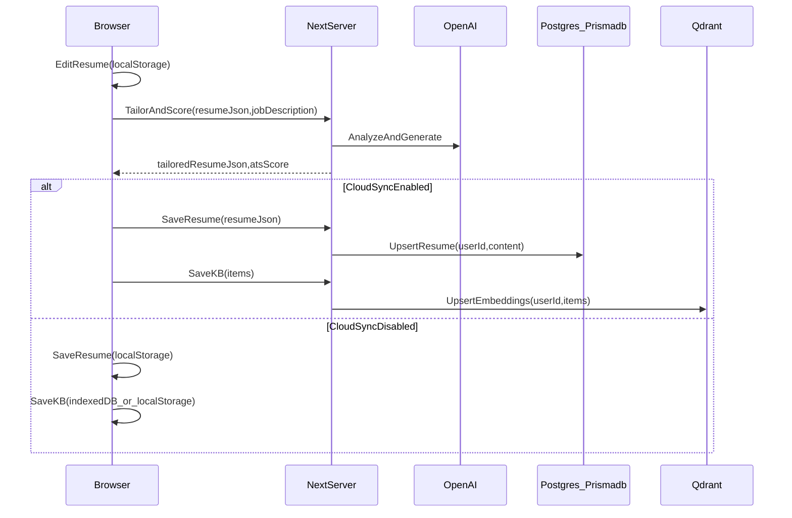

# AI Resume Builder: Claims Alignment + Polish Plan

## Target outcome (mapped to your claims)

- **UI-based + LaTeX editing**: keep current split editor, improve template flow + export reliability.
- **ATS scoring + JD-aware optimization**: make scoring more consistent/defensible, add “apply fixes” flows.
- **GitHub import + AI summarization**: make import robust (auth, pagination, richer repo signals) and produce structured, resume-ready project entries.
- **Privacy-first**: **local-first by default**, with **opt-in cloud sync** for signed-in users; minimize backend storage and keep third-party sharing explicit.

## Key product change: agentic chat tailoring (replaces the limited buttons)

### Why change it
- Today, **“Tailor Resume” and “Score” overlap** (both depend on the same job description + resume context) and the tailoring is a black box.\n+- The new flow should feel like a real process: **collect context → propose edits → show what changed → user approves → apply**.\n+\n+### New UX (section-by-section approval)\n+- Add an **AI Copilot** chat panel (sheet/drawer or right-side panel) accessible from the editor header.\n+- The copilot runs a guided workflow:\n+  - Step 1: Ask for **job description** if missing.\n+  - Step 2: Ensure **GitHub username** is present; if missing, ask.\n+  - Step 3: Pull context:\n+    - Current resume data (localStorage; if cloud sync ON, prefer latest server copy)\n+    - Knowledge base bullets (local by default; if sync ON, also query Qdrant for JD-relevant bullets)\n+    - GitHub repos (public-only by username; optionally fetch README for selected repos)\n+  - Step 4: Generate a **proposed resume patch** (Summary/Experience/Projects/Skills) and a **new ATS score**.\n+  - Step 5: Show **Before vs After** previews per section + a short “What changed” explanation.\n+  - Step 6: User can **Apply per section** (your chosen approval mode).\n+\n+### Chat UI elements\n+- Message bubbles for user/assistant\n+- “Work log” style system messages during run:\n+  - `Collecting job requirements…`\n+  - `Searching knowledge base…`\n+  - `Fetching GitHub repositories…`\n+  - `Drafting resume updates…`\n+  - `Computing ATS score…`\n+- A **Proposed Changes** card with tabs:\n+  - Summary / Experience / Projects / Skills\n+  - Each tab shows Before/After + `Apply this section` button\n+  - A final `Apply selected` button\n+\n+### Data-efficiency / agentic behavior rules\n+- **Context caching**:\n+  - Cache extracted JD keywords/requirements for the session.\n+  - Cache GitHub repo list for username for the session.\n+  - Only fetch READMEs for repos the agent selects or the user selects.\n+- **Minimize tokens**:\n+  - Don’t send entire resume JSON blindly; send compact section text.\n+  - For KB: retrieve top N relevant bullets, not whole database.\n+\n+## Updated architecture for the tailoring run\n+\n+```mermaid\n+sequenceDiagram\n+  participant User\n+  participant CopilotUI as Copilot_UI\n+  participant Store as LocalStore\n+  participant NextServer\n+  participant OpenAI\n+  participant GH as GitHub_API\n+  participant KBLocal as KB_Local\n+  participant KBCloud as KB_Qdrant\n+\n+  User->>CopilotUI: StartTailor\n+  CopilotUI->>Store: Read(resumeData,jobDescription,githubUsername)\n+  alt MissingJobDescription\n+    CopilotUI-->>User: AskForJobDescription\n+  end\n+  alt MissingGithubUsername\n+    CopilotUI-->>User: AskForGithubUsername\n+  end\n+\n+  CopilotUI->>KBLocal: SearchRelevantBullets(jobDescription)\n+  opt CloudSyncEnabled\n+    CopilotUI->>NextServer: SearchKnowledgeBase(jobDescription)\n+    NextServer->>KBCloud: VectorSearch(userId,jobDescription)\n+    NextServer-->>CopilotUI: topBullets\n+  end\n+\n+  CopilotUI->>NextServer: FetchGitHubRepos(username)\n+  NextServer->>GH: ListRepos\n+  NextServer-->>CopilotUI: repos\n+\n+  CopilotUI->>NextServer: ProposeResumePatch(resumeSections,jobDescription,repos,bullets)\n+  NextServer->>OpenAI: GenerateStructuredPatchAndScore\n+  NextServer-->>CopilotUI: proposedPatch,proposedScore\n+  CopilotUI-->>User: PreviewChanges(perSection)\n+  User->>CopilotUI: ApproveSelectedSections\n+  CopilotUI->>Store: ApplyPatchToResumeData\n+```\n+\n ## Proposed architecture (local-first + opt-in sync)
## Proposed architecture (local-first + opt-in sync)



## Implementation plan (what changes where)

### 0) Agentic chat tailoring flow (primary feature upgrade)

- **Unify “Score” + “Tailor”** into one agent action:\n+  - “Run analysis” always computes ATS + produces proposed edits.\n+  - “Score only” becomes an optional command inside the chat (or a secondary button) that skips patch generation.\n+- **Create a structured output contract** for the agent:\n+  - `ProposedResumePatch` = `{ sections: { summary?, experience?, projects?, skills? }, rationale: string[], atsScore: ATSScore }`\n+  - Each section output should be both:\n+    - Updated resume JSON for that section\n+    - A “diff-friendly” text summary (Before/After)\n+- **Implementation pieces**:\n+  - UI: new `Copilot` component mounted in the editor (sheet/right panel)\n+  - Store: temporary state for `proposedPatch`, `selectedSectionsToApply`, `copilotMessages`\n+  - Server: an action `proposeResumePatch()` that:\n+    - Gathers/accepts inputs: resume sections, JD, KB bullets, GitHub repos\n+    - Calls OpenAI to produce structured patch + ATS score\n+    - Validates with Zod; retries if invalid\n+- **Files (expected)**:\n+  - Add `[...]/src/components/copilot/ResumeCopilot.tsx`\n+  - Add `[...]/src/components/copilot/ProposedChangesCard.tsx`\n+  - Add `[...]/src/actions/copilot.ts` (or extend `[...]/src/actions/ai.ts`)\n+  - Extend `[...]/src/store/resumeStore.ts` with copilot/proposal state\n+  - Update `[...]/src/components/editor/JobTargetEditor.tsx` to either:\n+    - become the entry point for the copilot, or\n+    - be replaced by the copilot UI inside the “Job Target” section\n+\n ### 1) Privacy-first: opt-in cloud sync for resumes (Prisma model is currently unused)
### 1) Privacy-first: opt-in cloud sync for resumes (Prisma model is currently unused)

- **Add server actions** to upsert/fetch resume by Clerk `userId` using existing Prisma model.
  - Files:
    - Create `[...]/src/lib/prisma.ts` (PrismaClient singleton)
    - Add `[...]/src/actions/resume.ts `with `saveResumeToCloud()` and `loadResumeFromCloud()`
- **Add UI toggle** (default OFF) “Cloud sync” in the editor header.
  - File: `[...]/src/components/builder/EditorScreen.tsx`
- **Sync rules**:
  - If sync OFF: only Zustand persist/localStorage is used.
  - If sync ON (signed in): load on start, autosave (debounced), manual “Sync now”, and “Disconnect”.

### 2) Privacy-first: local Knowledge Base by default + optional server KB sync

- **Implement local KB store** (so sensitive “custom bullets” stay in-browser unless user opts in).
  - File: `[...]/src/store/resumeStore.ts` (or new `[...]/src/store/knowledgeBaseStore.ts`)
  - Storage: Zustand persist (quick win) or IndexedDB (better for size).
- **Gate Qdrant usage behind sync toggle**.
  - File: `[...]/src/actions/kb.ts` and `[...]/src/components/editor/KnowledgeBase.tsx`
  - Behavior:
    - Sync OFF: add/search locally (basic text search + optional lightweight scoring).
    - Sync ON: also upsert/search via Qdrant (existing implementation).

### 3) Harden LLM outputs (reduce “it broke” cases)

- **Validate all AI JSON** with Zod schemas; retry/repair on invalid JSON.
  - File: `[...]/src/actions/ai.ts`
  - Add `[...]/src/lib/aiSchemas.ts` (Zod schemas for ATSScore and ResumeData-like outputs)
- **Improve prompting to structured outputs** (explicit JSON keys, no prose).
- **Clamp/sanitize** returned resume fields (IDs, arrays, required fields).

### 4) ATS scoring + JD-aware optimization: make it more actionable

- **Improve ATS scoring method**:
  - Keep LLM score, but add deterministic signals (keyword overlap, skill hits, section completeness) and blend into final score.
  - File: `[...]/src/actions/ai.ts `(`calculateATSScore`)
- **Move “apply suggestions” into the copilot proposal flow**:
  - Suggestions are presented as explicit patch proposals per section.
  - Apply is section-by-section approval (your chosen mode), not silent overwrite.
  - Files:
    - `[...]/src/components/copilot/ProposedChangesCard.tsx`
    - `[...]/src/actions/copilot.ts` (or `[...]/src/actions/ai.ts`)

### 5) GitHub import polish (make the claim strong)

- **Support pagination + repo filtering** (stars, language, updated, topics).
  - Files:
    - `[...]/src/actions/github.ts`
    - `[...]/src/components/editor/GitHubImport.tsx`
- **Copilot integration**:
  - If GitHub username missing, the copilot asks for it.
  - Copilot can propose “include these 2–4 repos” and only then fetch READMEs for those.\n 
- **Richer project extraction**:
  - Fetch README + languages + topics.
  - AI returns structured JSON: `{ impactBullets[], tech[], summary }` then map into resume project entry.
  - Replace `any` types with proper TS interfaces.

### 6) LaTeX/export reliability + transparency

- **Make third-party compilation explicit** (current `compileLatex` sends LaTeX to `latex.ytotech.com`).
  - Add UI note + setting “Use external LaTeX compiler” (default ON, clearly disclosed).
  - Optional follow-up: self-host compile via Docker service.
  - Files: `[...]/src/actions/ai.ts`, `[...]/src/components/builder/EditorScreen.tsx`
- Remove noisy `console.log` in `[...]/src/app/latex-editor/page.tsx`.

### 7) General polish

- Replace `alert()` and console-only errors with shadcn toasts/alerts.
- Add loading skeletons and consistent empty states.
- Improve type safety (remove `any[]`, add shared types).

## Acceptance criteria (how we’ll know it matches the claims)

- **Local-first**: with sync OFF, resume + KB never hit Postgres/Qdrant; only AI calls occur.
- **Opt-in sync**: with sync ON, resumes persist across devices; KB can sync/search via Qdrant.
- **ATS**: score is stable (deterministic component) and suggestions can be applied in-app.
- **GitHub import**: imports selected repos into structured projects, not just a single rewritten blob.
- **LaTeX**: editor + preview + export are reliable, and external compilation is transparently disclosed.
- **Copilot**: tailoring run always shows per-section Before/After + requires explicit approval to apply.
