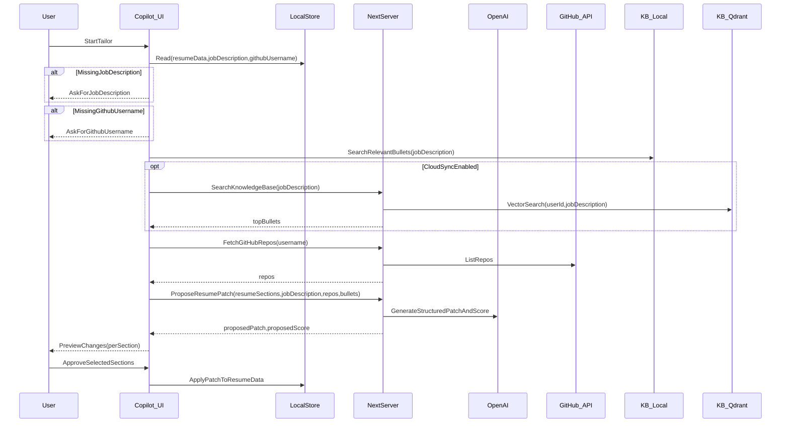
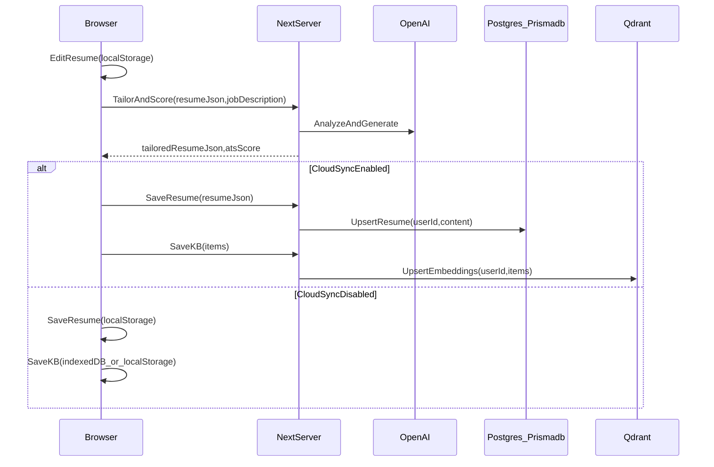

# AI Resume Builder: Claims Alignment + Polish Plan

## Target outcome (mapped to your claims)

- **UI-based + LaTeX editing**: keep current split editor, improve template flow + export reliability.
- **ATS scoring + JD-aware optimization**: make scoring more consistent/defensible, add “apply fixes” flows.
- **GitHub import + AI summarization**: make import robust (auth, pagination, richer repo signals) and produce structured, resume-ready project entries.
- **Privacy-first**: **local-first by default**, with **opt-in cloud sync** for signed-in users; minimize backend storage and keep third-party sharing explicit.

## Current state audit (so we don’t redo work)

### Already implemented
- Tailoring already recreates the resume (not just advice): `JobTargetEditor.tsx` calls `generateTailoredResume()` and overwrites `resumeData`.
- ATS scoring + breakdown UI already exists.
- AI JSON hardening is already partially implemented: `src/actions/ai.ts` uses Zod/repair (`parseWithRetry`) for ATS + tailored resume.
- GitHub import is already substantially upgraded: optional token, filters, topics/languages, typed repos, toasts.
- LaTeX compile/export works (currently via external compiler).

### Missing / gaps (what we still need to build)
- No preview/approval: tailoring directly mutates resume; user can’t review Before/After per section.
- No agentic context gathering: KB bullets + GitHub + saved cloud resume aren’t pulled into one pipeline.
- KB is not local-first: currently Qdrant-first.
- Prisma Resume cloud sync isn’t wired.
- ATS scoring is still fully LLM-based (validated, but not blended with deterministic signals).
- External LaTeX compiler isn’t disclosed/configurable.

## Key product change: agentic chat tailoring (replaces the limited buttons)

### Why change it
- Today, “Tailor Resume” and “Score” overlap and the tailoring is a black box.
- The new flow should feel like a real process: collect context → propose edits → show what changed → user approves → apply.

### New UX (section-by-section approval)
- Add an AI Copilot chat panel (sheet/drawer or right-side panel) accessible from the editor header.
- Copilot workflow:
  - Ask for job description if missing.
  - Ask for GitHub username if missing.
  - Gather context:
    - Resume baseline (local; if cloud sync ON, prefer latest server copy)
    - Knowledge base bullets (local by default; optionally Qdrant when sync ON)
    - GitHub repos (public by username; fetch READMEs only for shortlisted repos)
  - Produce a proposed patch + new ATS score.
  - Show Before/After per section with Apply buttons.

### “Chat-like” transparency
- Work-log system messages during run (fetching repos, searching KB, drafting updates, scoring).
- Proposed Changes card with tabs: Summary / Experience / Projects / Skills.
- Apply mode: per-section apply (your choice).

### Data-efficiency rules
- Cache JD extraction and GitHub repo lists per session.
- Fetch README only for shortlisted repos.
- Send compact section text instead of full resume JSON when possible.

## Updated architecture for the tailoring run

## Proposed architecture (local-first + opt-in sync)

## Implementation plan (what changes where)

### 0) Agentic chat tailoring flow (primary feature upgrade)

- Unify Score + Tailor into one agent action:
  - “Run analysis” computes ATS + produces proposed edits.
  - “Score only” becomes a chat command/secondary action.
- Proposal-based patching (no direct overwrite):
  - Agent returns `ProposedResumePatch` + diffs.
  - User applies per section.
- Wire real context into the run:
  - Resume baseline: local; if cloud sync ON, load latest.
  - Knowledge base: local-first; optionally Qdrant when sync ON.
  - GitHub: ask for username if missing; fetch public repos; fetch README only for shortlisted repos.
- Structured output contracts:
  - `ProposedResumePatch` = `{ sections: { summary?, experience?, projects?, skills? }, rationale: string[], atsScore: ATSScore, diffs: { summary?, experience?, projects?, skills? } }`
- Files (expected):
  - Add `[...]/src/components/copilot/ResumeCopilot.tsx`
  - Add `[...]/src/components/copilot/ProposedChangesCard.tsx`
  - Add `[...]/src/actions/copilot.ts` (or extend `[...]/src/actions/ai.ts`)
  - Extend `[...]/src/store/resumeStore.ts` with copilot/proposal state
  - Replace/rework `[...]/src/components/editor/JobTargetEditor.tsx` to become the copilot entry point

### 1) Privacy-first: opt-in cloud sync for resumes (Prisma model is currently unused)
### 1) Privacy-first: opt-in cloud sync for resumes (Prisma model is currently unused)

- **Add server actions** to upsert/fetch resume by Clerk `userId` using existing Prisma model.
  - Files:
    - Create `[...]/src/lib/prisma.ts` (PrismaClient singleton)
    - Add `[...]/src/actions/resume.ts `with `saveResumeToCloud()` and `loadResumeFromCloud()`
- **Add UI toggle** (default OFF) “Cloud sync” in the editor header.
  - File: `[...]/src/components/builder/EditorScreen.tsx`
- **Sync rules**:
  - If sync OFF: only Zustand persist/localStorage is used.
  - If sync ON (signed in): load on start, autosave (debounced), manual “Sync now”, and “Disconnect”.

### 2) Privacy-first: local Knowledge Base by default + optional server KB sync

- **Implement local KB store** (so sensitive “custom bullets” stay in-browser unless user opts in).
  - File: `[...]/src/store/resumeStore.ts` (or new `[...]/src/store/knowledgeBaseStore.ts`)
  - Storage: Zustand persist (quick win) or IndexedDB (better for size).
- **Gate Qdrant usage behind sync toggle**.
  - File: `[...]/src/actions/kb.ts` and `[...]/src/components/editor/KnowledgeBase.tsx`
  - Behavior:
    - Sync OFF: add/search locally (basic text search + optional lightweight scoring).
    - Sync ON: also upsert/search via Qdrant (existing implementation).

### 3) Harden LLM outputs (reduce “it broke” cases)

- Already partially done for ATS + tailored resume.
- Extend to the rest:
  - Update `extractKeywords()` to use the same `parseWithRetry` strategy (avoid regex JSON guessing).
  - Add Zod schema + repair for the new copilot patch format.
  - Keep a single shared parsing/repair helper.

### 4) ATS scoring + JD-aware optimization: make it more actionable

- **Improve ATS scoring method**:
  - Keep LLM score, but add deterministic signals (keyword overlap, skill hits, section completeness) and blend into final score.
  - File: `[...]/src/actions/ai.ts `(`calculateATSScore`)
- **Move “apply suggestions” into the copilot proposal flow**:
  - Suggestions are presented as explicit patch proposals per section.
  - Apply is section-by-section approval (your chosen mode), not silent overwrite.
  - Files:
    - `[...]/src/components/copilot/ProposedChangesCard.tsx`
    - `[...]/src/actions/copilot.ts` (or `[...]/src/actions/ai.ts`)

### 5) GitHub import polish (make the claim strong)

- Already partially done (filters, optional token, topics/languages, typed repos, toasts).
- Remaining work (to make it “agentic”):
  - Copilot asks for username if missing.
  - Copilot shortlists relevant repos for the job description.
  - Fetch README/languages/topics only for shortlisted repos.
  - AI returns structured project output: `{ summary, impactBullets[], tech[] }`, then map into resume projects.

### 6) LaTeX/export reliability + transparency

- **Make third-party compilation explicit** (current `compileLatex` sends LaTeX to `latex.ytotech.com`).
  - Add UI note + setting “Use external LaTeX compiler” (default ON, clearly disclosed).
  - Optional follow-up: self-host compile via Docker service.
  - Files: `[...]/src/actions/ai.ts`, `[...]/src/components/builder/EditorScreen.tsx`
- Remove noisy `console.log` in `[...]/src/app/latex-editor/page.tsx`.

### 7) General polish

- Replace `alert()` and console-only errors with shadcn toasts/alerts.
- Add loading skeletons and consistent empty states.
- Improve type safety (remove `any[]`, add shared types).

## Acceptance criteria (how we’ll know it matches the claims)

- **Local-first**: with sync OFF, resume + KB never hit Postgres/Qdrant; only AI calls occur.
- **Opt-in sync**: with sync ON, resumes persist across devices; KB can sync/search via Qdrant.
- **ATS**: score is stable (deterministic component) and suggestions can be applied in-app.
- **GitHub import**: imports selected repos into structured projects, not just a single rewritten blob.
- **LaTeX**: editor + preview + export are reliable, and external compilation is transparently disclosed.
- **Copilot**: tailoring run always shows per-section Before/After + requires explicit approval to apply.
