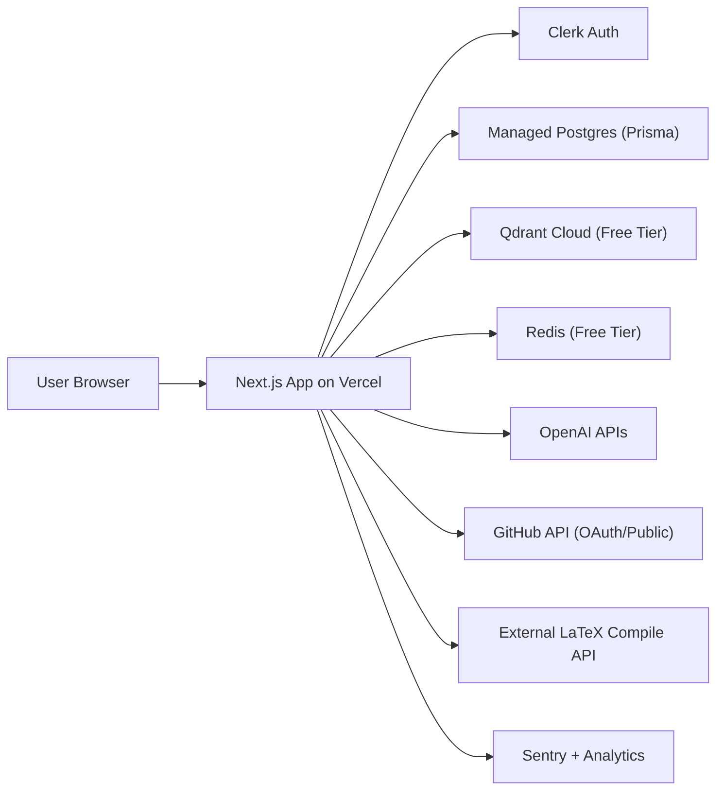

# AI Resume Builder Foundation Plan (Vercel MVP)

Last updated: 2026-02-28
Owner: Product + Engineering
Scope: Build a production-credible foundation for early user acceptance on minimal infrastructure cost.

## 1) Objective

Build a developer-focused resume platform that can:

1. Collect user context once (profile + job description + GitHub).
2. Generate a job-tailored resume in one flow.
3. Let users review, edit, and export confidently.
4. Keep user data secure and trustworthy from day one.

Constraint: run lean for early users on Vercel with only essential managed services.

## 2) Validation Summary (Based on Current Codebase)

Strengths already present:

1. Next.js app structure is solid for modular monolith growth.
2. Clerk auth is integrated.
3. Resume editing + ATS + AI generation are already implemented.
4. Prisma + Postgres exists, and cloud sync path exists.

Critical gaps before wider user acceptance:

1. Security risk: GitHub token is stored in `localStorage` (`src/components/editor/GitHubImport.tsx`).
2. Authorization gap: knowledge-base actions accept `userId` from client (`src/actions/kb.ts` call pattern).
3. Data model is too thin (`Resume` only) for multi-resume/versioning/auditability.
4. Qdrant + Redis need clear guardrails (cost, limits, fallback) to stay MVP-safe.
5. No explicit architecture guardrails for cost control vs future scale.

Conclusion: the product should stay as a **modular monolith** on Vercel now, with a stricter security baseline plus Qdrant/Redis free-tier integration. Do not split services yet.

## 3) Architecture Decisions (Now vs Later)

| Area | Decision for MVP (Now) | Why | Revisit Trigger | Likely Later |
|---|---|---|---|---|
| App architecture | Modular monolith in Next.js (App Router + server actions/routes) | Fastest path, lowest ops load | >5k MAU or team split pain | Split worker/service boundaries |
| Hosting | Vercel only | Best DX for current stack | Function timeout/cold-start pain | Hybrid: Vercel + dedicated workers |
| Auth | Clerk | Already integrated, low setup | Enterprise auth requirements | Add org/SSO controls |
| DB | Managed Postgres + Prisma | Already in place, sufficient for MVP | Heavy analytics/vector workloads | Add read replicas + event pipeline |
| Vector/KB | Use Qdrant Cloud free tier for semantic KB retrieval | Improves one-shot tailoring quality for developers | Free-tier storage/latency limits | Upgrade Qdrant tier or hybrid with pgvector |
| Jobs/queues | Use Redis free tier for rate limiting, short TTL caches, and lightweight async coordination | Better reliability and cost control with minimal ops | Queue depth/retry complexity grows | Dedicated worker runtime and stronger orchestration |
| GitHub integration | OAuth App preferred; if not ready, disable PAT persistence and keep public-repo mode | Removes token leakage risk | Private repo demand increases | Full OAuth + encrypted token lifecycle |
| Export | Keep external LaTeX compile API for now | Avoid running LaTeX infra | Reliability/compliance concerns | Managed PDF pipeline with retries |
| Observability | Vercel logs + Sentry + product analytics basics | Minimum operational visibility | Incident/debug friction | Full tracing and SLO dashboards |

## 4) Recommended MVP System Architecture

Design intent:

1. Keep the architecture simple, deployable, and low cost.
2. Minimize moving parts while enforcing real security rules.
3. Preserve clear seams so scaling later does not require rewrite.

## 5) Security Baseline (Must-Have Before Acceptance Rollout)

### P0 (non-negotiable)

1. Remove persistent GitHub PAT storage in browser.
   - Immediate fallback: remove `localStorage` PAT storage and treat token as session-only input.
   - Preferred: implement GitHub OAuth flow and store encrypted token server-side.
2. Enforce server-side ownership checks everywhere.
   - Never trust client-provided `userId`.
   - In server actions, derive user identity from Clerk session only.
3. Add request validation for all mutation endpoints/server actions.
   - Use `zod` schemas for payloads.
4. Add rate limiting for AI-heavy and GitHub-heavy routes (Redis-backed).
5. Add data deletion path (user can remove resume data).

### P1 (should ship in MVP window)

1. Audit event logging for sensitive operations:
   - save, delete, export, GitHub connect/disconnect.
2. Basic abuse monitoring (request spikes, repeated failures).
3. Restrictive env-var handling and secret hygiene checks in CI.

## 6) Data Model v1 (Minimal but Extensible)

Keep it lean but future-safe. Recommended additions:

1. `resumes`
   - `id`, `userId`, `title`, `currentVersionId`, timestamps
2. `resume_versions`
   - immutable snapshots (`content` JSON), `resumeId`, `source` (`manual|ai|import`), timestamps
3. `job_targets`
   - `id`, `userId`, `company`, `role`, `description`, timestamps
4. `generation_runs`
   - inputs/outputs metadata, model name, duration, status, error
5. `github_connections` (if OAuth enabled)
   - `userId`, provider account ID, encrypted token reference, scopes, timestamps
6. `knowledge_items`
   - `id`, `userId`, `content`, `type`, `tags`, timestamps
7. `kb_embeddings`
   - `knowledgeItemId`, `userId`, `qdrantPointId`, embedding model, timestamps

Notes:

1. Keep `content` JSON schema versioned (`schemaVersion`) to support migration later.
2. Use DB indexes on `userId` and common query keys.
3. Postgres stays source-of-truth; Qdrant is a derived index (safe to rebuild).

## 7) UX/Product Plan (One-Shot Developer Flow)

### End-to-end flow

1. Sign in.
2. Complete quick context onboarding:
   - target role, experience level, preferred stack, location, links.
3. Paste job description.
4. Connect/import GitHub context.
5. Generate tailored resume draft.
6. Review AI suggestions with rationale and apply selectively.
7. Export PDF and save version.

### UX quality bars for MVP

1. Clear save/sync states.
2. Explain why AI made each key change.
3. Error states with actionable recovery.
4. Mobile-usable editor for critical actions.
5. No misleading claims like "always private in browser" if cloud sync exists.

## 8) Phased Delivery (Cost-Conscious)

## Phase 0: Foundation Hardening (Week 1)

1. Security fixes (PAT handling, authz on KB actions, payload validation).
2. Data model migration for resume versions + job targets.
3. Update user-facing privacy/copy to match real behavior.

Exit criteria:

1. No client-side persistent secrets.
2. All user-scoped mutations enforce authz from session.
3. Migrations deployed and app stable on Vercel preview.

## Phase 1: MVP Acceptance Build (Weeks 2-3)

1. One-shot generation flow polish.
2. Versioned resume save/load.
3. Basic GitHub integration hardening (public repos at minimum, OAuth preferred).
4. Qdrant-backed semantic KB retrieval with strict user filtering.
5. Redis-backed rate limiting + short TTL caching for expensive operations.
6. Basic analytics + error tracking.

Exit criteria:

1. New user can get exportable tailored resume in <10 minutes.
2. Core flows succeed reliably for small cohort.
3. Cost remains low with only essential managed services.

## Phase 2: Paid-Readiness (Post-Validation)

1. Upgrade Redis-based async flow to dedicated workers only when needed.
2. Enhance retrieval with hybrid search/reranking; evaluate pgvector or higher Qdrant tier if needed.
3. Advanced scoring quality and experimentation framework.
4. Team/org and billing expansion.

Trigger: clear user retention and willingness to pay.

## 9) Minimal Infrastructure Stack for Early Users

Use only these initially:

1. Vercel (web + server actions/routes).
2. Clerk (auth).
3. Managed Postgres (Neon/Supabase/Railway Postgres).
4. OpenAI API.
5. Qdrant Cloud free tier (vector retrieval).
6. Redis free tier (Upstash recommended) for rate limiting/cache/light async coordination.
7. Sentry (or equivalent) for errors.

Do not add initially:

1. Dedicated worker cluster.
2. Multi-service microservice deployment.

## 10) Reliability and Cost Guardrails

1. Set strict OpenAI token/usage caps per user/session.
2. Cache deterministic/repeatable computations where possible.
3. Use conservative model defaults (`gpt-4o-mini` class) for MVP.
4. Add timeout + retry policies for external APIs.
5. Log per-request latency and failure reasons for all AI and GitHub calls.
6. Add fail-soft behavior when Qdrant/Redis is degraded (editing and export must still work).

## 11) Risks and Mitigations

1. Risk: Vercel timeouts on long AI workflows.
   - Mitigation: break work into smaller calls, progressive UI updates, defer queue infra until needed.
2. Risk: GitHub private data handling complexity.
   - Mitigation: start with public repo import + OAuth roadmap; avoid PAT local persistence.
3. Risk: Qdrant/Redis free-tier limits (storage, throughput, daily quotas).
   - Mitigation: cap indexed items per user, TTL cache keys, and monitor usage weekly.
4. Risk: AI quality inconsistency.
   - Mitigation: structured output validation + deterministic scoring blend.
5. Risk: Cost spikes from prompt size.
   - Mitigation: input trimming, caching, and hard usage limits.

## 12) Immediate Execution Checklist (Next 10 Tasks)

1. Remove GitHub PAT `localStorage` writes/reads.
2. Refactor KB actions to derive `userId` from Clerk auth server-side.
3. Add `zod` validation on server action inputs.
4. Add DB migration for `resume_versions` and migrate save/load logic.
5. Add `job_targets` persistence.
6. Add event/error logging around AI/GitHub/export actions.
7. Add basic rate limiting on costly endpoints.
8. Add Qdrant index/sync flow for `knowledge_items` with strict user-scoped filters.
9. Align UI privacy copy with real data storage behavior.
10. Deploy Vercel preview + run acceptance test script with 5-10 pilot users.

## 13) Definition of Success for Acceptance Cohort

1. 70%+ of pilot users complete first tailored export.
2. Median time-to-first-export under 10 minutes.
3. No critical security issue found in pilot.
4. Stable operations without adding non-essential infrastructure.

---

This plan intentionally prioritizes **security correctness + user value + low operational cost** over premature scale complexity.
