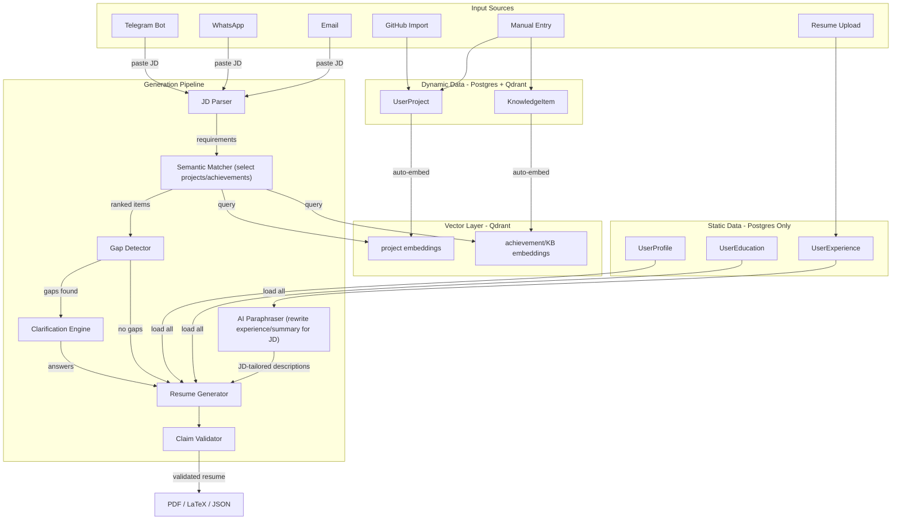
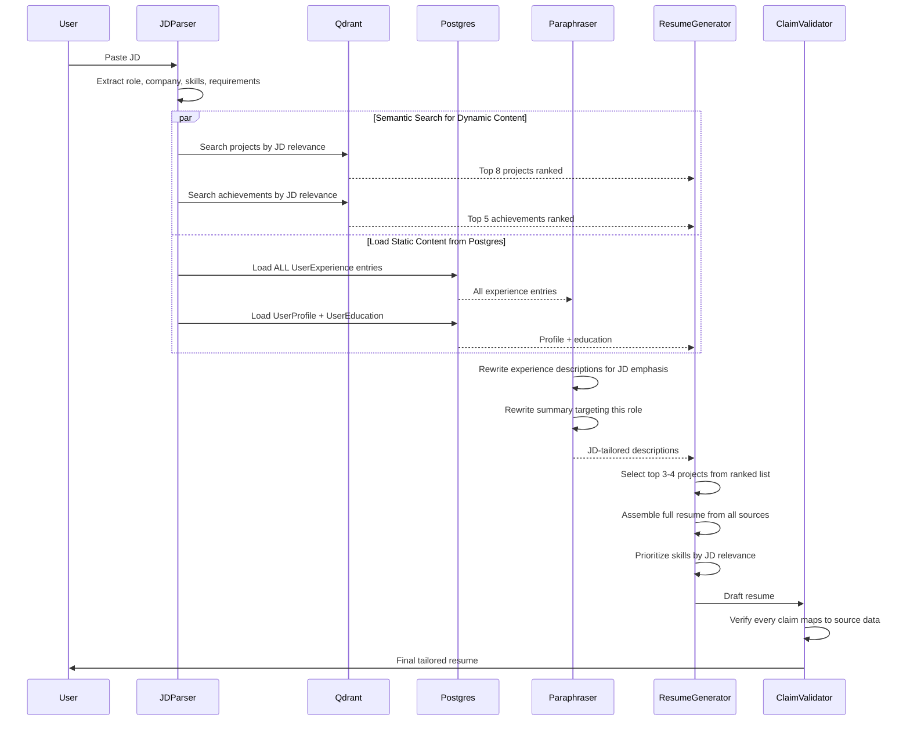
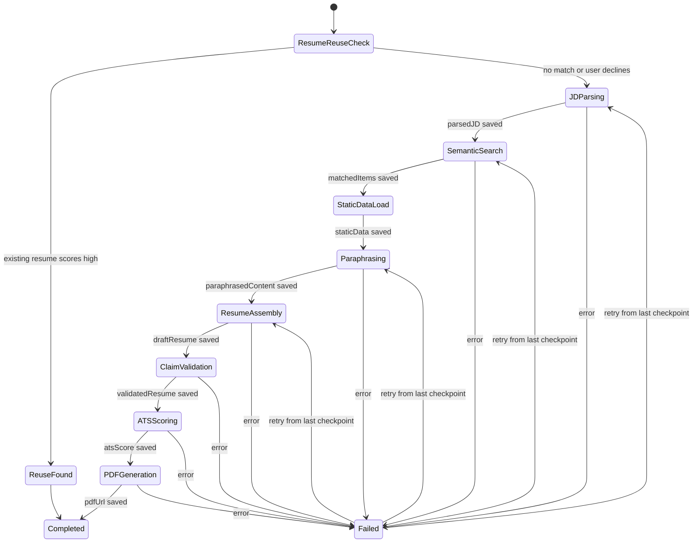

# Knowledge-Base-Driven Automated Resume Generation

**Date:** 2026-02-28
**Status:** Draft
**Scope:** Data model redesign, smart KB with auto-embedding, intelligent resume generation pipeline, multi-channel delivery (Telegram/WhatsApp/email).

---

## Overview

Redesign the data model to separate static user data (profile, experience, education) in Postgres from dynamic/selective data (projects, achievements, OSS contributions) in Postgres+Qdrant. Build an intelligent pipeline that semantically selects relevant projects/achievements per JD, paraphrases static experience descriptions at generation time, and produces tailored resumes with zero manual intervention — eventually served via Telegram/WhatsApp/email.

---

## Todos / Checklist

- [x] **Phase 1:** Add Prisma models (UserProfile, UserProject, UserExperience, UserEducation, KnowledgeItem) + migration
- [x] **Phase 1:** Build CRUD server actions for profile, projects, experiences, education
- [x] **Phase 1:** Profile page + project library UI on dashboard
- [x] **Phase 2:** Build embedding service (embed.ts) — generateEmbedding, upsertToQdrant, deleteFromQdrant
- [x] **Phase 2:** Auto-embed pipeline — trigger on project/KB item create/update (NOT experience/education)
- [x] **Phase 2:** Refactor GitHub import to auto-create UserProject + auto-embed + dedup
- [x] **Phase 2:** Re-embed utility for rebuilding Qdrant from Postgres
- [x] **Phase 3:** JD parser — extract role, skills, requirements into structured format
- [x] **Phase 3:** Semantic matching for projects/achievements (Qdrant) + load all static data (Postgres)
- [x] **Phase 3:** AI paraphraser — rewrite experience descriptions and summary to match JD (same facts, different emphasis)
- [x] **Phase 3:** Smart resume generator — assemble from profile + selected projects + paraphrased experience
- [x] **Phase 3:** Claim validator — verify every bullet maps to source data
- [x] **Phase 3:** One-click generate UI — paste JD, get resume
- [x] **Phase 4:** Clarification engine — gap detection, question generation, session state
- [x] **Phase 5:** Channel-agnostic generation API endpoint
- [x] **Phase 5:** Telegram bot — webhook, identity linking, conversational flow
- [ ] **Phase 6:** Quality guardrails — auto ATS scoring, truth enforcement, user preferences
- [ ] **Phase 7:** Admin dashboard — aggregated pipeline metrics, total/per-user token usage, cost tracking, billing data
- [ ] **Phase 7:** API usage logging — log every OpenAI/embedding call with tokens, cost, latency, userId, sessionId
- [ ] **Phase 7:** Per-user usage limits and billing-ready usage summaries
- [ ] **Phase 8:** Pipeline state persistence — checkpoint every step of generation so failures can resume
- [ ] **Phase 8:** PDF blob storage — store all generated PDFs (S3/R2/Vercel Blob) to avoid costly re-generation
- [ ] **Phase 8:** Smart resume reuse — before generating, check if an existing resume already scores high for this JD/role

---

## The Problem Today

The current system has a **thin knowledge base** — `kb.ts` stores arbitrary text blobs in Qdrant with type/tags but no structured backing in Postgres. Projects exist only inside resume JSON (`ResumeData.projects`), not as standalone entities. There is no user profile model, no auto-embedding pipeline, no deduplication, and no way to automatically select the right projects/achievements for a given JD. Everything requires manual intervention in the editor.

---

## Architecture Overview

**Postgres is the source of truth for all user data. Qdrant is a derived semantic index for selective/dynamic content only.**

User data falls into two categories:

1. **Static data (Postgres only, NO embeddings):** Personal info, experience, education. These go into every resume as-is. The AI paraphrases descriptions and summary at generation time to match the JD — that's a generation-time task, not a retrieval/selection task.

2. **Dynamic/selective data (Postgres + Qdrant embeddings):** Projects, achievements, OSS contributions, certifications, custom items. Users build a *library* of 20+ items over time, and the system needs to *select* the 3-5 most relevant ones per JD. That's where semantic search earns its keep.



---

## Phase 1: Data Foundation — Structured User Profile

**Goal:** Every piece of user information lives as a standalone entity in Postgres, independent of any specific resume.

### New Prisma Models

Add to `prisma/schema.prisma`:

```prisma
model UserProfile {
  id              String   @id @default(cuid())
  userId          String   @unique
  fullName        String   @default("")
  email           String   @default("")
  phone           String   @default("")
  location        String   @default("")
  website         String   @default("")
  linkedin        String   @default("")
  github          String   @default("")
  defaultTitle    String   @default("")
  defaultSummary  String   @default("")
  yearsExperience String   @default("")
  preferences     Json?
  createdAt       DateTime @default(now())
  updatedAt       DateTime @updatedAt
}

model UserProject {
  id             String   @id @default(cuid())
  userId         String
  name           String
  description    String   @default("")
  url            String   @default("")
  githubUrl      String?
  technologies   Json     @default("[]")
  readme         String   @default("")
  source         ProjectSource @default(manual)
  qdrantPointId  String?
  embedded       Boolean  @default(false)
  createdAt      DateTime @default(now())
  updatedAt      DateTime @updatedAt

  @@unique([userId, githubUrl])
  @@index([userId, updatedAt])
}

enum ProjectSource {
  github
  manual
}

model UserExperience {
  id          String   @id @default(cuid())
  userId      String
  company     String
  role        String
  startDate   String
  endDate     String   @default("")
  current     Boolean  @default(false)
  location    String   @default("")
  description String   @default("")
  highlights  Json     @default("[]")
  createdAt   DateTime @default(now())
  updatedAt   DateTime @updatedAt

  @@index([userId, updatedAt])
}

model UserEducation {
  id           String   @id @default(cuid())
  userId       String
  institution  String
  degree       String
  fieldOfStudy String   @default("")
  startDate    String
  endDate      String   @default("")
  current      Boolean  @default(false)
  createdAt    DateTime @default(now())
  updatedAt    DateTime @updatedAt

  @@index([userId])
}

model KnowledgeItem {
  id            String   @id @default(cuid())
  userId        String
  type          KnowledgeType
  title         String
  content       String
  metadata      Json?
  qdrantPointId String?
  embedded      Boolean  @default(false)
  createdAt     DateTime @default(now())
  updatedAt     DateTime @updatedAt

  @@index([userId, type])
}

enum KnowledgeType {
  achievement
  oss_contribution
  certification
  award
  publication
  custom
}
```

### Server Actions

- New file: `src/actions/profile.ts` — CRUD for UserProfile (upsert on first sign-in, load on dashboard).
- New file: `src/actions/projects.ts` — CRUD for UserProject with auto-embed trigger.
- New file: `src/actions/experiences.ts` — CRUD for UserExperience (Postgres only, no embedding).
- Extend `src/actions/kb.ts` — refactor to use KnowledgeItem Postgres model as source-of-truth, Qdrant as derived.

### Key Design Decision: User Profile as First-Class Entity

Currently, personal info only exists inside `ResumeData.personalInfo`. With `UserProfile`, users enter their info once, and every generated resume pulls from it. This means:

- Profile page on dashboard where users manage their canonical info
- Resume generation reads from `UserProfile` + `UserExperience` + `UserEducation` (not from a previous resume)
- Resumes become **outputs**, not the source of truth

---

## Phase 2: Smart Knowledge Base — Auto-Embed Pipeline

**Goal:** Every time a project or knowledge item (achievement, OSS contribution, etc.) is created/updated, it automatically gets embedded into Qdrant. on update stale data should be removed from quadrant db.  Experience and education are static — they live only in Postgres and get paraphrased by AI properly according to JD and user preferences at generation time.

### What Gets Embedded vs What Doesn't

| Data Type | Storage | Qdrant Embedding | Why |
|---|---|---|---|
| Projects | Postgres + Qdrant | Yes | User has 10-30+ projects, need to *select* top 3-5 per JD |
| Achievements/Awards | Postgres + Qdrant | Yes | Selective — pick relevant ones per JD |
| OSS Contributions | Postgres + Qdrant | Yes | Selective — pick relevant ones per JD |
| Certifications | Postgres + Qdrant | Yes | Selective — include if relevant to JD |
| Experience | Postgres only | No | All entries go into every resume; descriptions get *paraphrased* per JD at generation time |
| Education | Postgres only | No | Goes into every resume as-is, verbatim |
| Personal Info | Postgres only | No | Same across all resumes |

### Auto-Embed Pipeline

Refactor `src/actions/kb.ts` into a proper embedding service:

```
src/actions/
  embed.ts          — Core embedding logic (generateEmbedding, upsertToQdrant, deleteFromQdrant)
  projects.ts       — UserProject CRUD + auto-embed on create/update
  experiences.ts    — UserExperience CRUD (Postgres only, no embedding)
  kb.ts             — KnowledgeItem CRUD + auto-embed (refactored)
```

The embedding content per type should be rich:

- **Projects:** `"{name}. {description}. Technologies: {technologies.join(', ')}. {readme.slice(0, 2000)}"`
- **Achievements:** `"{title}: {content}"`
- **OSS Contributions:** `"{title}. {content}. {metadata.repo}"`

### Qdrant Collection Strategy

Keep a single `knowledge_base` collection (already exists) with improved payload structure:

```json
{
  "userId": "clerk_user_id",
  "type": "project | achievement | oss_contribution | certification | ...",
  "sourceId": "cuid from Postgres",
  "title": "Project Name",
  "content": "full text that was embedded",
  "createdAt": "ISO timestamp"
}
```

Filter by `userId` + `type` in every query. This allows us to search "find me the top 5 projects relevant to this JD" with a single query.

### GitHub Import Flow (Refactored)

Current flow: fetch repos → display in UI → user manually adds to resume.

New flow:

1. User connects GitHub (enters username) with proper validation so we know it's user's github account, then only proceed otherwise first tell user to integrate github properly, → fetch repos via `src/actions/github.ts` , also let user know that project info is directly coming from reamde.md file only , please keep them updated properly
2. User selects repos to import → for each repo:
   a. Check if `UserProject` with same `githubUrl` exists for this user → **skip if exists** (dedup)
   b. Fetch repo details (README, languages, topics) via `fetchRepoDetails`
   c. Create `UserProject` in Postgres with structured data
   d. Auto-embed: generate embedding from `{name} + {description} + {technologies} + {readme}` → upsert to Qdrant
   e. Update `UserProject.qdrantPointId` and `embedded = true`
3. Projects are now in the user's "library" — available for all future resumes

### Manual Project Creation

Same flow but without GitHub fetch:

1. User fills form (name, description, URL, technologies)
2. Create `UserProject` in Postgres
3. Auto-embed → Qdrant
4. Available in library

### Re-Embed Command

A utility action `reEmbedAllForUser(userId)` that, this should be each project level only otherwise will waste a lot of embedding tokens at once

1. Loads all UserProjects + KnowledgeItems from Postgres (not experience/education — those don't get embedded)
2. Regenerates embeddings for each
3. Bulk upserts to Qdrant
4. don't work on this now , we will do this properly later

This is the "rebuild derived index" safety net from the foundation plan.

---

## Phase 3: Intelligent Resume Generation Pipeline

**Goal:** Given a JD, automatically produce a complete, high-quality, tailored resume using only the user's real data.

### The Pipeline (New Server Action: `src/actions/generateResume.ts`)



### Step-by-Step

**Step 0: Smart Resume Reuse Check** — Before doing any expensive generation work, check if the user already has a resume that's a strong match for this JD:

1. Load all existing resumes for the user from Postgres (they already have `targetRole`, `targetCompany`, `atsScore` metadata).
2. Quick semantic similarity: compare the JD against existing resume titles/roles. If a resume targets the same role/company or a very similar one, shortlist it.
3. If any existing resume has an ATS score >= 80 for a similar role, present it to the user: "You already have a resume for [Senior SWE @ Google] with an 87% ATS score. Want to use that, or generate a fresh one?"
4. If the user accepts → return that resume immediately (zero AI cost).
5. If the user declines or no strong match exists → proceed to Step 1 (full generation pipeline).

This saves significant cost — many users apply to similar roles repeatedly. No need to spend tokens re-generating when a high-quality resume already exists.

**Step 1: JD Parser** — Extract structured info from raw JD text:

```typescript
interface ParsedJD {
  role: string;
  company: string;
  requiredSkills: string[];
  preferredSkills: string[];
  experienceLevel: string;
  keyResponsibilities: string[];
  industryDomain: string;
}
```

Use OpenAI with structured output (Zod schema) to parse. Cache results keyed by JD hash.

**Step 2: Semantic Matching (dynamic content only)** — Query Qdrant with the JD text to find relevant items:
- only that user embeddings should be matched and not with any other user's embeddings strictly chck this
- Search with `type=project` filter → get top 8 projects with relevance scores
- Search with `type=achievement` filter → get top 5 achievements
- Search with `type=oss_contribution` filter → get relevant OSS work
- Load full structured data from Postgres using `sourceId` from Qdrant results

**Step 2b: Load Static Data (no Qdrant needed)** — Load from Postgres directly:

- Load ALL `UserExperience` entries (they all go into the resume)
- Load ALL `UserEducation` entries
- Load `UserProfile` for personal info + default summary
- These don't need ranking — they're always included

**Step 3: Smart Selection (for dynamic content)** — Combine semantic scores with deterministic scoring:

- Does the project use technologies mentioned in JD? (+weight)
- Is the achievement quantified? (+weight)
- Recency bonus for newer projects
- Select top 3-4 projects, top 3-5 achievements

**Step 3b: AI Paraphrasing (for static content)** — Rewrite experience descriptions for the JD:

- For each `UserExperience` entry, paraphrase `description` + `highlights` to emphasize JD-relevant aspects
- Rewrite the professional summary to target this specific role
- Keep all facts/metrics identical — only reword emphasis and ordering
- This is a generation-time AI task, not a retrieval task

**Step 4: Resume Assembly** — Use AI to generate the resume, but constrained to only user's real data:

The key prompt engineering change from current `generateTailoredResume` in `src/actions/ai.ts`:

- Current: sends full resume data + asks AI to "tailor" (AI can hallucinate)
- New: sends **specific selected items** from KB + explicit instruction "ONLY use the provided data, do not fabricate any claims, achievements, or metrics not present in the source material"

**Step 5: Claim Validation** — Post-generation check:

- For each bullet point in the generated resume, verify it maps back to a source (project, experience, achievement) in the user's data
- Flag any content that doesn't have a clear source
- This can be a secondary AI pass or deterministic keyword matching

### Integration with Existing Code

The current `generateTailoredResume` in `src/actions/ai.ts` takes `githubRepos` and `knowledgeBullets` as optional params. The new pipeline replaces those with automatic KB retrieval. The function signature becomes:

```typescript
export async function generateSmartResume(
  jobDescription: string,
  options?: { 
    templatePreference?: string;
    maxProjects?: number;
    focusAreas?: string[];
  }
): Promise<{ resume: ResumeData; sources: SourceMap; atsEstimate: number }>
```

No more passing in repos or bullets manually — the function queries KB internally.

---

## Phase 4: Clarification Engine

**Goal:** When the system detects gaps between JD requirements and user's KB, ask targeted questions before generating.

### Gap Detection

After semantic matching (Phase 3, Step 2), compare:

- JD required skills vs user's projects/experience → find unmatched skills
- JD experience level vs user's years of experience
- JD domain keywords vs user's content

If significant gaps exist (e.g., JD requires Kubernetes but user has no K8s projects/experience), generate clarification questions:

```typescript
interface ClarificationQuestion {
  id: string;
  category: 'missing_skill' | 'experience_detail' | 'project_relevance' | 'preference';
  question: string;
  context: string; // why we're asking
  suggestedOptions?: string[]; // for multiple-choice style
}
```

Examples:

- "This role requires Kubernetes experience. Do you have any K8s experience we should include?"
- "I found 2 relevant projects. Should I prioritize [Project A] (infra-focused) or [Project B] (full-stack)?"
- "The JD mentions 'team leadership'. Can you describe a time you led a team?"

### State Management

New model for tracking generation sessions:

```prisma
model GenerationSession {
  id              String   @id @default(cuid())
  userId          String
  jobTargetId     String?
  jobDescription  String
  parsedJD        Json?
  matchedItems    Json?
  clarifications  Json?    // questions asked + answers received
  status          GenerationStatus @default(pending)
  resultResumeId  String?
  channel         Channel  @default(web)
  createdAt       DateTime @default(now())
  updatedAt       DateTime @updatedAt

  @@index([userId, updatedAt])
}

enum GenerationStatus {
  pending
  awaiting_clarification
  generating
  completed
  failed
}

enum Channel {
  web
  telegram
  whatsapp
  email
}
```

This is critical for multi-channel support — the session persists across messages.

---

## Phase 5: Multi-Channel Interface

**Goal:** Users can paste a JD on Telegram/WhatsApp/email and get a tailored resume back.

### Architecture

All channels converge to a single channel-agnostic API:

```
POST /api/generate
{
  "sessionId": "optional - for continuing a conversation",
  "userId": "clerk user id (resolved from channel identity)",  
  "channel": "telegram | whatsapp | email | web",
  "message": "the JD text or answer to clarification question"
}

Response:
{
  "sessionId": "abc123",
  "status": "awaiting_clarification | generating | completed",
  "questions": [...],  // if awaiting_clarification
  "resume": {...},     // if completed
  "pdfUrl": "..."      // if completed
}
```

### Telegram Bot (Start Here)

New files:

- `src/app/api/telegram/webhook/route.ts` — Telegram webhook handler
- `src/lib/telegram.ts` — Telegram Bot API client
- `src/actions/channelGenerate.ts` — Channel-agnostic generation orchestrator

Flow:

1. User links their Telegram to their account (on web dashboard, one-time setup)
2. User sends JD text to bot
3. Bot creates a `GenerationSession`, runs pipeline
4. If clarifications needed → bot sends questions as inline keyboard buttons
5. User answers → bot continues pipeline
6. Resume generated → bot sends PDF + ATS score

### User Identity Linking

New model:

```prisma
model ChannelIdentity {
  id         String   @id @default(cuid())
  userId     String
  channel    Channel
  externalId String   // Telegram chat ID, phone number, email
  verified   Boolean  @default(false)
  createdAt  DateTime @default(now())

  @@unique([channel, externalId])
  @@index([userId])
}
```

---

## Phase 6: Quality Guardrails

### Truth Enforcement

- Every generated resume bullet should carry a `sourceId` internally (mapping to UserProject, UserExperience, or KnowledgeItem)
- The `ClaimValidator` rejects any bullet where >50% of content cannot be traced to user data
- Metrics/numbers in bullets must exist in source data (no fabricated "increased by 40%")

### ATS Quality

- After generation, automatically run ATS scoring (already exists in `src/actions/ai.ts`)
- If score < 70, auto-iterate: identify weak areas, strengthen with KB content, regenerate weak sections
- Target: 80+ ATS score on first generation

### User Preferences (stored in `UserProfile.preferences`)

```typescript
interface UserPreferences {
  defaultTemplate: 'ats-simple' | 'modern' | 'classic';
  defaultSectionOrder: SectionType[];
  maxProjects: number; // default 3
  includeOSS: boolean;
  tonePreference: 'formal' | 'conversational' | 'technical';
  autoGenerate: boolean; // auto-generate without clarification questions
}
```

---

## Phase 7: Admin Dashboard & Usage/Cost Tracking

**Goal:** Full visibility into system usage — both aggregated (admin) and per-user (for billing). Every AI call, embedding, and PDF generation is tracked with token counts and costs.

### Why This Matters

Every resume generation involves multiple API calls (JD parsing, embedding searches, paraphrasing, assembly, claim validation, ATS scoring, LaTeX compilation). Without tracking, you can't:
- Know how much each user costs you
- Set fair pricing tiers
- Detect abuse or runaway usage
- Debug slow/expensive generations

### Data Model

```prisma
model ApiUsageLog {
  id            String   @id @default(cuid())
  userId        String
  sessionId     String?
  operation     String
  provider      String
  model         String
  inputTokens   Int      @default(0)
  outputTokens  Int      @default(0)
  totalTokens   Int      @default(0)
  costUsd       Float    @default(0)
  latencyMs     Int      @default(0)
  status        String   @default("success")
  metadata      Json?
  createdAt     DateTime @default(now())

  @@index([userId, createdAt])
  @@index([sessionId])
  @@index([createdAt])
}
```

### What Gets Logged

| Operation | Provider | What to Track |
|---|---|---|
| `jd_parse` | OpenAI | Tokens in/out, model, latency |
| `embedding_generate` | OpenAI | Tokens, embedding model, item type |
| `semantic_search` | Qdrant | Latency, result count (no token cost) |
| `paraphrase_experience` | OpenAI | Tokens per experience entry |
| `resume_assembly` | OpenAI | Tokens (largest call), model |
| `claim_validation` | OpenAI | Tokens |
| `ats_scoring` | OpenAI | Tokens |
| `latex_compile` | External API | Latency, success/fail |
| `pdf_storage` | Blob Storage | File size, storage cost |

### Implementation

New file: `src/lib/usageTracker.ts` — a wrapper around OpenAI calls that automatically logs usage:

```typescript
interface TrackableCall {
  userId: string;
  sessionId?: string;
  operation: string;
}

async function trackedChatCompletion(
  params: OpenAI.ChatCompletionCreateParams,
  tracking: TrackableCall
): Promise<OpenAI.ChatCompletion> {
  const start = Date.now();
  const result = await openai.chat.completions.create(params);
  const latencyMs = Date.now() - start;

  await prisma.apiUsageLog.create({
    data: {
      userId: tracking.userId,
      sessionId: tracking.sessionId,
      operation: tracking.operation,
      provider: 'openai',
      model: params.model,
      inputTokens: result.usage?.prompt_tokens ?? 0,
      outputTokens: result.usage?.completion_tokens ?? 0,
      totalTokens: result.usage?.total_tokens ?? 0,
      costUsd: calculateCost(params.model, result.usage),
      latencyMs,
      status: 'success',
    },
  });

  return result;
}
```

All existing OpenAI calls in `ai.ts`, `copilot.ts`, `kb.ts`, `generate.ts` get refactored to use this tracked wrapper. No behavior change — just adds logging.

### Admin Dashboard

New page: `/admin` (protected by role check — only admin users)

**Aggregated View:**
- Total tokens used (today / this week / this month)
- Total cost breakdown by operation type
- Total generations completed vs failed
- Average latency per operation
- Top 10 heaviest users

**Per-User View (click into a user):**
- Token usage over time (chart)
- Cost breakdown by operation
- Generation history with session details
- Current usage vs their plan limits

### Per-User Billing Readiness

Store a monthly usage summary for billing:

```prisma
model UserUsageSummary {
  id            String   @id @default(cuid())
  userId        String
  periodStart   DateTime
  periodEnd     DateTime
  totalTokens   Int      @default(0)
  totalCostUsd  Float    @default(0)
  totalGenerations Int   @default(0)
  totalPdfs     Int      @default(0)
  breakdown     Json?
  createdAt     DateTime @default(now())

  @@unique([userId, periodStart])
  @@index([userId])
}
```

A daily/hourly cron aggregates `ApiUsageLog` rows into `UserUsageSummary`. This is what billing reads from — never scan raw logs at billing time.

---

## Phase 8: Pipeline Resilience & Artifact Storage

**Goal:** The generation pipeline is a long-running, multi-step process involving multiple API calls. Any step can fail (OpenAI timeout, Qdrant down, LaTeX compile error). Persist state at every checkpoint so failures don't waste the work already done. Also store generated PDFs in blob storage to avoid re-generating expensive artifacts.

### Pipeline State Machine

The generation pipeline has clear steps, each producing an output that feeds the next. Persist each step's result in `GenerationSession`:



### Extended GenerationSession Model

Extend the Phase 4 `GenerationSession` model with step-level persistence:

```prisma
model GenerationSession {
  id              String   @id @default(cuid())
  userId          String
  jobTargetId     String?
  jobDescription  String
  channel         Channel  @default(web)

  // Step outputs — each step writes its result here
  currentStep     PipelineStep @default(reuse_check)
  parsedJD        Json?
  matchedProjects Json?
  matchedAchievements Json?
  staticData      Json?
  paraphrasedContent Json?
  draftResume     Json?
  validationResult Json?
  atsScore        Int?
  pdfBlobKey      String?

  // Clarification flow
  clarifications  Json?
  
  // Outcome
  status          GenerationStatus @default(pending)
  resultResumeId  String?
  errorMessage    String?
  errorStep       PipelineStep?

  // Timing
  startedAt       DateTime @default(now())
  completedAt     DateTime?
  totalLatencyMs  Int?
  totalTokensUsed Int?
  totalCostUsd    Float?

  createdAt       DateTime @default(now())
  updatedAt       DateTime @updatedAt

  @@index([userId, updatedAt])
  @@index([status])
}

enum PipelineStep {
  reuse_check
  jd_parsing
  semantic_search
  static_data_load
  awaiting_clarification
  paraphrasing
  resume_assembly
  claim_validation
  ats_scoring
  pdf_generation
  completed
}
```

### How Resume Works

Each pipeline step:
1. Checks `currentStep` to know where to start (or resume from)
2. Executes its work
3. Writes its output to the corresponding field (`parsedJD`, `matchedProjects`, etc.)
4. Updates `currentStep` to the next step
5. If it fails → sets `status = failed`, `errorStep = currentStep`, `errorMessage`

On retry:
1. Load the session
2. Read `currentStep` — all previous step outputs are already persisted
3. Resume from the failed step using the already-computed data
4. No wasted tokens re-doing JD parsing or semantic search if those already succeeded

### Resume Action

New server action: `retryGenerationSession(sessionId: string)`:
1. Load session, verify ownership
2. Check `currentStep` and `errorStep`
3. Jump directly to the failed step — all prior inputs are in the session row
4. Continue the pipeline from there

### PDF Blob Storage

Generating a PDF (LaTeX compile) is expensive and slow. Store the result so we never have to regenerate it:

**Storage:** Use Vercel Blob, Cloudflare R2, or AWS S3 — whichever is cheapest for the scale. Start with Vercel Blob since the app is already on Vercel.

**Flow:**
1. After successful LaTeX compilation → upload PDF to blob storage
2. Store the blob URL/key in `GenerationSession.pdfBlobKey` and also in a dedicated table:

```prisma
model GeneratedPdf {
  id            String   @id @default(cuid())
  userId        String
  resumeId      String
  sessionId     String?
  blobKey       String
  blobUrl       String
  fileSizeBytes Int
  template      String   @default("ats-simple")
  createdAt     DateTime @default(now())
  expiresAt     DateTime?

  @@index([userId, createdAt])
  @@index([resumeId])
}
```

**Benefits:**
- User requests PDF export → serve from blob instantly (no LaTeX recompilation)
- Telegram/WhatsApp bot can send the stored PDF URL
- Historical PDFs available for download from dashboard
- Can set expiry for old PDFs to control storage costs

**Cache Strategy:**
- When resume content changes → mark existing PDFs as stale (don't delete yet)
- On next PDF request → regenerate and store new version
- Keep last 3 versions per resume for rollback

### Cost Savings Summary

| Without Phase 8 | With Phase 8 |
|---|---|
| Pipeline failure = all tokens wasted, start from scratch | Resume from last checkpoint, prior tokens preserved |
| PDF re-generated on every export/download | Serve from blob storage instantly |
| Same role applied 5 times = 5 full generations | Reuse check catches duplicates, zero cost for repeat requests |
| No visibility into what failed or why | `errorStep` + `errorMessage` pinpoints the issue |

---

## Implementation Roadmap

```mermaid
gantt
    title Implementation Roadmap
    dateFormat X
    axisFormat %s

    section Phase1
    Prisma Schema Migration           :p1a, 0, 2
    UserProfile CRUD + Profile Page    :p1b, 2, 4
    UserProject CRUD                   :p1c, 2, 4
    UserExperience + Education CRUD    :p1d, 4, 6

    section Phase2
    Embedding Service Refactor         :p2a, 6, 8
    Auto-Embed on Project Create       :p2b, 8, 10
    GitHub Import Refactor + Dedup     :p2c, 8, 11
    Manual Project UI + Embed          :p2d, 10, 12
    Re-Embed Utility                   :p2e, 12, 13

    section Phase3
    Smart Resume Reuse Check           :p3z, 13, 14
    JD Parser                          :p3a, 14, 16
    Semantic Matching                  :p3b, 16, 18
    Smart Selection + Ranking          :p3c, 18, 20
    Resume Assembly with Sources       :p3d, 20, 23
    Claim Validator                    :p3e, 23, 25
    One-Click Generate UI              :p3f, 25, 27

    section Phase4
    Gap Detection                      :p4a, 27, 29
    Clarification Questions            :p4b, 29, 31
    Session State Management           :p4c, 29, 31

    section Phase5
    Channel-Agnostic API               :p5a, 31, 33
    Telegram Bot                       :p5b, 33, 37
    Identity Linking                   :p5c, 33, 35
    WhatsApp + Email                   :p5d, 37, 41

    section Phase6
    ATS Auto-Scoring                   :p6a, 41, 43
    Truth Enforcement                  :p6b, 43, 45
    User Preferences                   :p6c, 43, 45

    section Phase7
    API Usage Logger Wrapper           :p7a, 45, 47
    ApiUsageLog + UserUsageSummary     :p7b, 45, 47
    Admin Dashboard UI                 :p7c, 47, 51
    Per-User Usage View                :p7d, 49, 51
    Billing-Ready Summaries            :p7e, 51, 53

    section Phase8
    Pipeline Step Persistence          :p8a, 53, 56
    Retry from Checkpoint              :p8b, 56, 58
    PDF Blob Storage                   :p8c, 56, 59
    Smart Resume Reuse Deep            :p8d, 59, 61
```



---

## Key Files to Create

**Phase 1-3 (Core):**
- `src/actions/embed.ts` — core embedding service
- `src/actions/profile.ts` — UserProfile CRUD
- `src/actions/projects.ts` — UserProject CRUD + auto-embed
- `src/actions/experiences.ts` — UserExperience CRUD (Postgres only)
- `src/actions/generateResume.ts` — the smart generation pipeline (includes reuse check)
- `src/actions/clarify.ts` — gap detection + question generation
- `src/components/dashboard/ProfileSection.tsx` — profile management UI
- `src/components/dashboard/ProjectLibrary.tsx` — project library UI
- `src/components/editor/tools/QuickGeneratePanel.tsx` — one-click generate in editor

**Phase 5 (Multi-Channel):**
- `src/actions/channelGenerate.ts` — channel-agnostic orchestrator
- `src/app/api/telegram/webhook/route.ts` — Telegram webhook
- `src/app/api/generate/route.ts` — REST endpoint for external channels
- `src/lib/telegram.ts` — Telegram Bot API wrapper

**Phase 7 (Admin + Usage):**
- `src/lib/usageTracker.ts` — tracked OpenAI wrapper that auto-logs tokens/cost
- `src/actions/admin.ts` — admin dashboard data queries (aggregated + per-user)
- `src/app/(app)/admin/page.tsx` — admin dashboard page
- `src/components/admin/UsageOverview.tsx` — aggregated metrics charts
- `src/components/admin/UserUsageTable.tsx` — per-user usage breakdown

**Phase 8 (Resilience + Storage):**
- `src/lib/pipelineRunner.ts` — step-by-step pipeline executor with checkpoint persistence
- `src/actions/retrySession.ts` — retry a failed generation from its last checkpoint
- `src/lib/blobStorage.ts` — PDF upload/download wrapper (Vercel Blob / S3 / R2)

## Key Files to Modify

- `prisma/schema.prisma` — add new models (UserProfile, UserProject, KnowledgeItem, ApiUsageLog, UserUsageSummary, GeneratedPdf, extended GenerationSession)
- `src/actions/kb.ts` — refactor to use Postgres as source-of-truth
- `src/actions/github.ts` — add auto-embed after import
- `src/actions/ai.ts` — add JD parser, claim validator, wrap all OpenAI calls with usage tracker
- `src/actions/generate.ts` — replace with smart pipeline + reuse check
- `src/actions/copilot.ts` — wrap OpenAI calls with usage tracker
- `src/types/resume.ts` — add new types for generation pipeline
- Dashboard page — add profile section + project library

---

## Critical Design Decisions

1. **Postgres-first, Qdrant-derived:** All data lives in Postgres. Qdrant can be fully rebuilt from Postgres. This is safe and auditable.
2. **Embeddings only for selective content:** Projects, achievements, and other dynamic items get embedded. Experience, education, and personal info do NOT — they're static and always included in every resume. AI paraphrases them at generation time.
3. **Single Qdrant collection with type filtering** (not separate collections per type): Simpler to manage, still fast with proper filtering.
4. **Deduplication by `githubUrl` for projects:** `@@unique([userId, githubUrl])` prevents double-importing the same repo.
5. **Generation sessions for multi-channel state:** The `GenerationSession` model tracks the entire conversation across messages, making it channel-agnostic.
6. **Source tracking for truth enforcement:** Every generated bullet carries a reference back to the KB item it came from. No untraceable claims.
7. **Telegram first for multi-channel:** Simplest API, most common for developer audience, no costs beyond hosting.
8. **Every AI call is metered:** The usage tracker wrapper sits between our code and OpenAI — all existing and future calls get automatic token/cost logging with zero extra effort per call site. This is the foundation for billing.
9. **Pipeline checkpointing:** Each generation step writes its output to the session row before proceeding. On failure, the session knows exactly where it stopped and what data it already has. Retry picks up from the failed step, not from scratch.
10. **PDF as a stored artifact, not a re-computable output:** LaTeX compilation is slow and flaky. Once a PDF is generated, store it in blob storage and serve from there. Only re-generate when resume content actually changes.
11. **Reuse before regenerate:** Always check existing resumes first. If a user already has a high-scoring resume for a similar role, offer it before burning tokens on a new generation. Users applying to 10 similar SWE roles shouldn't cost 10x.
